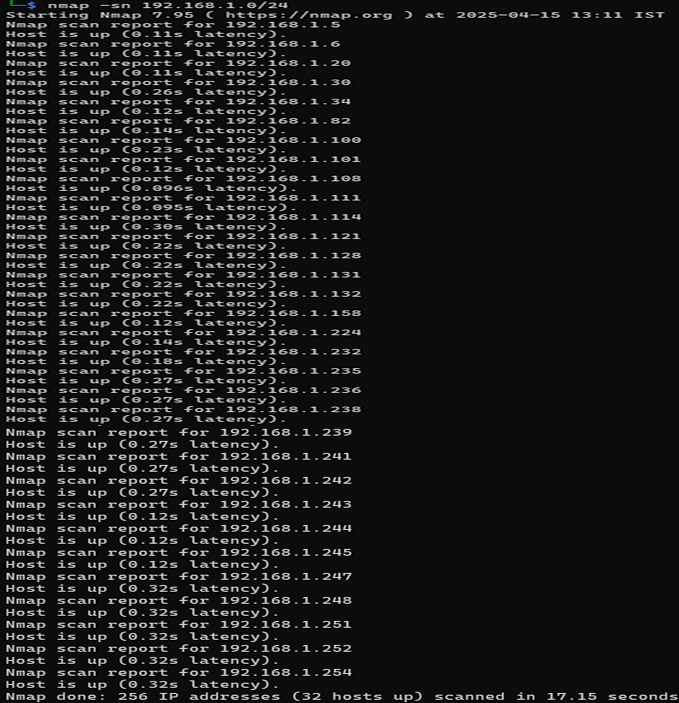
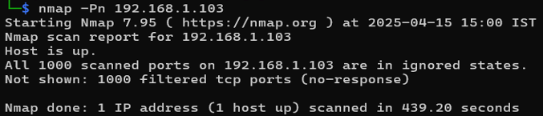
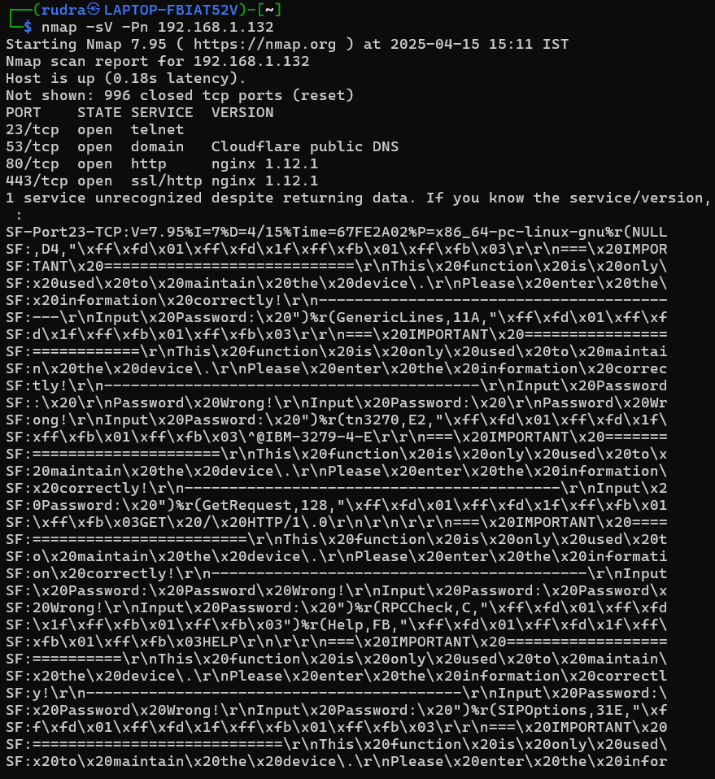
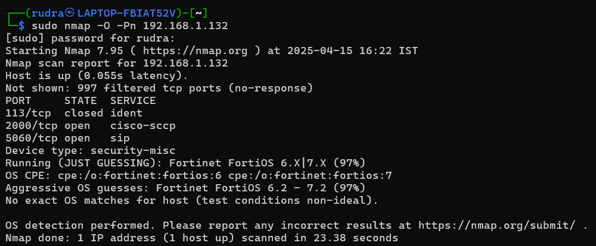
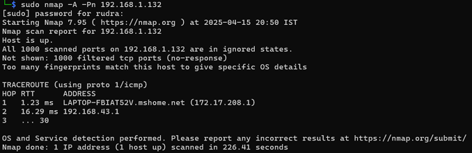
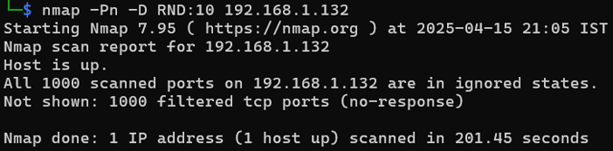

# Network Scanning with Nmap on Metasploitable 2

Network discovery and enumeration against a deliberately vulnerable VM in an isolated lab.

## Objective
Identify live hosts, open ports, service versions and the operating system of the target, and understand how scan results guide vulnerability assessment.

## Environment
- **Attacker:** Kali Linux
- **Target:** Metasploitable 2 (`192.168.1.132` in my lab)
- **Virtualization:** VirtualBox 
- **Tool:** Nmap

## Methodology
| Step | Command | Purpose |
|------|---------|---------|
| Live host discovery | `nmap -sn 192.168.1.0/24` | Ping sweep to find active hosts |
| Port scan | `nmap -Pn 192.168.1.132` | Find open TCP ports |
| Service versions | `nmap -sV -Pn 192.168.1.132` | Identify software and versions |
| OS detection | `sudo nmap -O -Pn 192.168.1.132` | Fingerprint the operating system |
| Aggressive scan | `sudo nmap -A -Pn 192.168.1.132` | OS, versions, scripts and traceroute (noisy) |
| Decoy scan | `nmap -Pn -D RND:10 192.168.1.132` | Test IDS-evasion with decoy source IPs |

## Findings
- 15+ open ports, including FTP, SSH, Telnet, HTTP and SMB.
- Outdated software, including **Apache 2.2.8** and **vsftpd 2.3.4**, both known to be vulnerable.
- OS fingerprint indicated a Linux system (Ubuntu-based), consistent with Metasploitable 2.

## Key Learnings
- Scanning is the foundation for choosing what to test next.
- Version detection maps services to known CVEs.
- Aggressive scans give the most detail but are the easiest to detect.

## Screenshots
**Live host discovery**

**Port scan**

**Service version detection**

**OS detection**

**Aggressive scan**

**Decoy scan**

Scans were run only against my own isolated lab VM. Never scan networks or hosts without permission.
